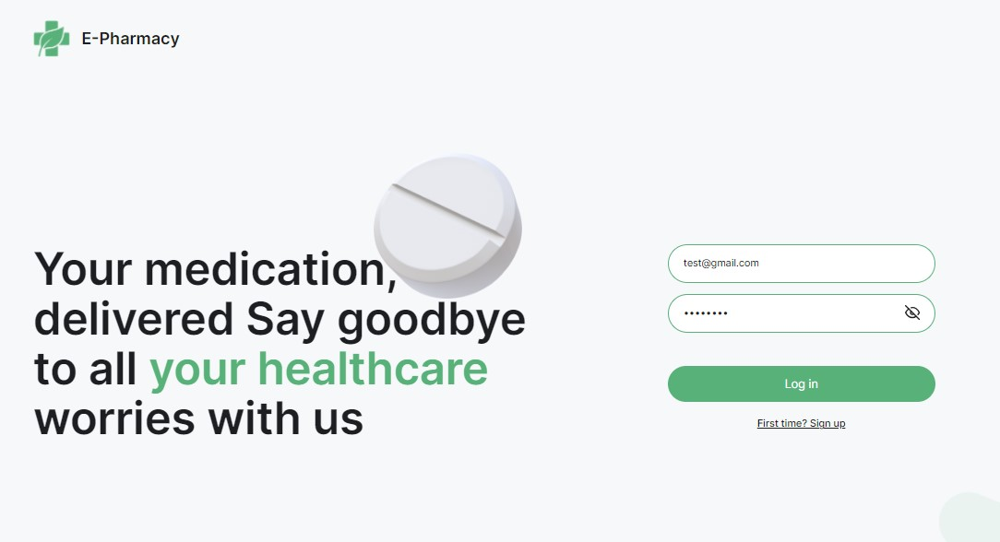

# 𝕄𝕖𝕕𝕚𝕔𝕚𝕟𝕖 𝕤𝕥𝕠𝕣𝕖 

  

This project was created using [Vite](https://vitejs.dev/) + [Create React App](https://github.com/facebook/create-react-app). 

## 𝔽𝕖𝕒𝕥𝕦𝕣𝕖𝕤 𝕒𝕟𝕕 𝕋𝕖𝕔𝕙𝕟𝕠𝕝𝕠𝕘𝕚𝕖𝕤 ᎓    

  </a>&nbsp;
  &nbsp;
  &nbsp;
  &nbsp;
  &nbsp;
  &nbsp;
  &nbsp;
  &nbsp;
  &nbsp;
  &nbsp;  
  
※ Admin Dashboard for Medicine store.  
※ Application for monitoring and editing the database of goods, customers, and suppliers.  
※ Registration at the start.  
※ Viewing general statistics.  
※ Ability to filter within each category by name.  
※ C R U D.  

※ [Vite.js](https://vitejs.dev/) & [React.js](https://react.dev): for building user interfaces.   
※ [React Router DOM](https://www.npmjs.com/package/react-router-dom): Declarative routing for React web applications.  
※ [Redux Toolkit](https://redux-toolkit.js.org): State management for React applications.  
※ [Styled Components](https://styled-components.com): Styling library for React components.  
※ [Ant Design](https://ant.design/): library of user interface components.  
※ [React Hook Form](https://www.react-hook-form.com/) and [Yup](https://formik.org/docs/tutorial#schema-validation-with-yup): for data collection and validation.  
※ [React Select](https://react-select.com/home): flexible Select Input control.  
※ [Axios](https://axios-http.com): HTTP client for database operation.  
※ [Bruno](https://www.usebruno.com/): innovative API client, an alternative to Postman.  
※ [React Modal](https://www.npmjs.com/package/react-modal): simple pop-up.  
※ [React Hot Toast](https://react-hot-toast.com/): for notifications.  

View Frontend:  

View Backend:  
  

View Layout:  
  

View Swagger:  
  

Questions, suggestions, help:  

   
